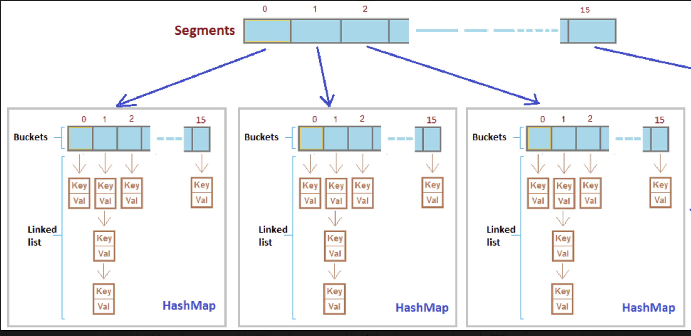

### Rust implementation of a Java ConcurrentHashMap

This was a code-along based on a live stream by Jon Gjengset.  
I'm just trying to learn Rust.  
-Link to Jon's YouTube live stream [Click on me!!!](https://www.youtube.com/watch?v=yQFWmGaFBjk)

- The underlying data structure for ConcurrentHashMap is Hashtable.

  - Hash table maps keys to values.
  - To successfully store and retrieve objects from a hashtable, the objects used as keys must implement the hashCode method and the equals method.
  - ConcurrentHashMap class is thread-safe i.e. multiple threads can operate on a single object without any complications.
  - only lockes while adding or updating the map. But allows concurrent threads to **read the value without locking** at all.
  - ConcurrentHashMap utilizes the same principles of HashMap, but is designed primarily for a multi-threaded application and hence it does not require explicit synchronization.
  - Hashtable provides concurrent access to the Map...many different threads can access the map.
  - A very useful data type that is used a lot...but very difficult to 'get right'.

  

#### The main challenge for Rust

- Rust does not have a Garbage collector like Java does...so implementing concurrency means we have to know when to free things ('drop' things in Rust). Many threads will try to access the map...as well as re-sizing of the map may also need to occur.

---

Having a Mutex around the Map would be ok in a simple usecase, but where high performance is required...you want to utilize all of the cores on a computer...each sharing the same Map. With a Mutex only one thread can access the Map at a time.

Implementation should support 'full concurrency' on retrivals (means allow reads never blocking) and 'high expected' concurrency for updates (meaning 'writes' might block sometimes).
